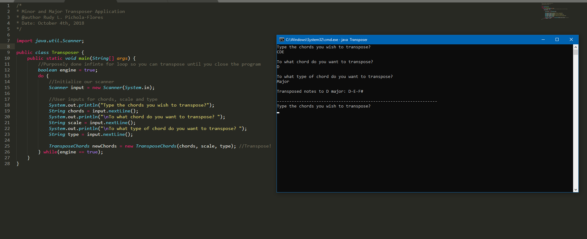

# Tranposer

A minimalistic transposer console application that transposes major and minor musical chords!

## Features
Main features to look at before testing this simple application

 - Support for multiple chord transposing.
 - Support for octaves and root notes!
 - Minor chord support through a modified version of the Major chord tranposer logic.
 
## Goals
These goals are to be achieved at a certain point in time and improve the functionality of this application!

 - Support for more scale types.
 - Improvement in logic for transposing chords.
 - Feature to provide users with randomized progressions within their desired scale.

